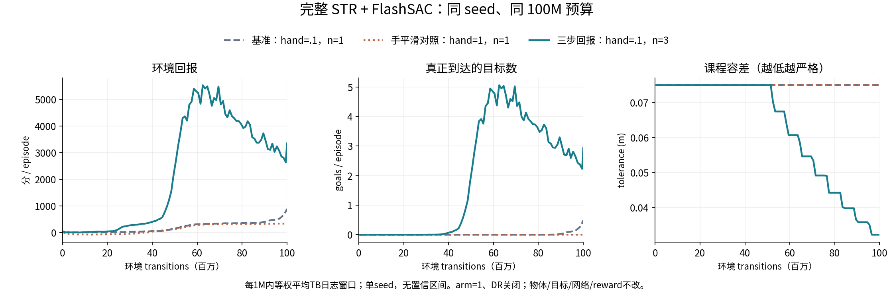

# 完整 STR + FlashSAC：本轮最终结果

2026-09-10。本轮两组新增100M均已结束并保存，无GPU任务继续运行。结论是**n_step=3明显建立了连续目标跟踪能力，但尚未达到可靠抓取搬运/完整收敛**；不是“已经复现论文”，也不是“FlashSAC训不了STR”。

03:55已通过应用暂停flashsac-str自动续查，避免本轮结束后反复唤醒；不再追加训练或评测。

## 1. 改了什么，没改什么

参考为已完成的arm=1、hand=.1、n_step=1、seed0、100,003,840 transitions。新实验各自从零训练同预算：

- hand_response_20260910：只把手EMA .1→1，退步；最终确定性/随机各64条首轨迹均0goal。
- 本目录：恢复hand=.1，只把FlashSAC n_step 1→3，明显改善。

机械臂/手为KUKA iiwa14+Sharpa，不是Wuji；保持完整6类/1200资产训练分布、随机初始状态和随机位置/姿态goal、50-goal任务链、原reward、reset、成功计数、课程规则、gamma=.99、2048env、FlashSAC网络和优化设置。DR关闭。Actor仍为140维前馈网络，critic162维，29维动作，未加LSTM，未换PPO，未简化为固定eraser任务。

代码遵循最小改动/Ponytail：复用原生训练、replay、多步TD target和已有play入口；本轮只增加配置、边界测试及旁路统计，不复制一套算法。36项CPU预检通过，含真正终止不bootstrap、超时final_obs与多步跨reset隔离。

## 2. 同预算训练曲线

90,003,840 < transitions <= 100,003,840，99个日志窗口等权均值。不是将全部episode重新按数量加权的精确总体率。

| 指标 | 基准n=1/hand=.1 | hand=1/n=1 | n=3/hand=.1 |
|---|---:|---:|---:|
| 原始环境episode return | 529.02 | 329.06 | 3065.13 |
| 完成goals/episode | .15134 | .000320 | 2.64265 |
| Keypoint累计reward | 21.19 | 6.71 | 83.13 |
| 曾越过抬升阈值（lift bonus/300） | 91.95% | 91.87% | 82.95% |
| fall终止窗口比例 | 84.26% | 59.89% | 64.70% |
| hand_far终止窗口比例 | 14.00% | 40.29% | 1.88% |
| 最后tolerance | .075 | .075 | .032285 |

fall与hand_far可能重叠，不能相加当失败并集；hand=1的fall下降伴随hand_far大增，不是抓稳了。旧n=1训练没有新增的连续高度指标，不填0。n=3末段约41.48%的episode持续高于初始高度10cm至少1秒，这是几何代理，未测接触力。



n=3在50–60M的goals/episode约3.85、return4294；之后容差继续收紧，末值为.075×.9^8=.032285。中期回报回落与课程变严格同时发生，不能直接断定策略退化，也不能证明回落全部由课程解释；区分需要跨checkpoint固定同容差评测。本次最终play统一冻结为.075，未评测训练末容差或.01。

## 3. 配对首episode play：真正完成了多少goal

每组同seed、64个完全相同初始状态，最多观察1200步≈20秒/首episode；确定性与原生随机分别运行。每组使用同一批64资产，六类样本不均衡，不是覆盖全部1200资产或论文24任务评测。

| 观察指标 | n=1确定性 | n=3确定性 | n=1随机 | n=3随机 |
|---|---:|---:|---:|---:|
| 至少到达1个goal的首轨迹 | 11/64 | 31/64 | 10/64 | 31/64 |
| 观察到的总goal数 | 32 | 318 | 28 | 338 |
| 每条初始轨迹观察到的goal均值 | .500 | 4.969 | .438 | 5.281 |
| 连续抬高超过10cm至少1秒 | 8/64 | 29/64 | 7/64 | 24/64 |
| 真失败并集（fall或hand_far） | 62 | 49 | 62 | 55 |
| 环境自身超时 | 2 | 12 | 2 | 8 |
| 20秒观察截止仍未结束 | 0 | 3 | 0 | 1 |
| 观察到完整50goal链完成 | 0 | 0 | 0 | 0 |

**31/64不是完整任务成功率。** 总goal数包含观察截止时尚未结束的轨迹，因此4.969/5.281是每条初始轨迹在观察窗口内的计数均值，不是完整episode均值。确定性未结束三条brush（env0/45/56）已达30/45/28goals；随机未结束brush env45已达37goals。它们不是失败，不知道继续运行后的最终结果。

环境自然超时是单个goal长期未完成引发的截断，与人为20秒观察截止不同。没有将新goal当整episode reset；没有把后续自动重置的新episode混进首episode统计。done_dropped在当前配置关闭，不能拿其0值宣称不掉落。

分类型，n=3“至少1goal的首轨迹数 / 总goal数”：brush（24条）确定性12/190、随机13/202；eraser（12）5/27、5/18；hammer（10）6/40、6/63；marker（2）1/2、0/0；screwdriver（12）6/53、5/51；spatula（4）1/6、2/4。样本少且不均衡，不能用来排名物体难度。

## 4. 视频与产物核验

视频：[paired_play.mp4](play/paired_play.mp4)，40秒，前20秒确定性，后20秒随机，四视角预先选择hammer/env1、spatula/env6、eraser/env8、brush/env0。选视角时没有按成功筛选。

已查看0.7、2、5秒帧：有物体离手/失败，也有连续移动物体并累积goal的画面。5秒时brush/env0仍是首episode，已11goals；其他视角中有first_episode=False，表示已自动重置，不能将其goal计入本表。

核验项目全部通过：

- training_complete.json与play/play_complete.json内容均status=complete；队列两个子任务returncode=0；服务inactive、GPU无计算进程。
- 视频ffprobe：H264、960×720、30fps、1200帧、40秒。
- 基准与n=3同模式的初始obs/joint_pos/joint_vel/object/goal/prev_targets/cur_targets逐元素一致；asset文件名及env分配一致，只有生成临时目录不同。
- Play前后model digest均82b4806c4516e327388918d4192cb6116490123a6be4dd34cb69a4bb098611a4。实际actor文件SHA256与记录一致：7f01a2e2fd58ec4b0b041ab47b6a8afbadd0347ed5b23f604c486adca11efcd5。
- preflight列出的8项源文件SHA256匹配，完整task与expected_task_config.json一致；运行时TB也记录n_step=3、gamma=.99、2048env、无checkpoint/replay加载。

最终模型：candidate/models/seed0/step48830，native update_step=195120；模型、critic、target critic、温度、reward normalizer、agent state、replay共7份文件非空。

replay_buffer.pt为25,480,003,499字节，CPU mmap读取成功：10,000,000条，302维组合观测、29维动作、reward/terminated/truncated/discount以及next_obs；ring index9999744。n=3队列末尾的2个并行步（4096条）未形成完整3-step样本；不是遗失整个训练记录。与n=1相比预填多2步，native更新调用少8次，属于n-step自然边界差异。

若后续续训，应使用同一个n_step=3配置及其匹配replay，不混用n=1 replay。保存的不是环境/RNG/curriculum快照，不能声称逐步精确恢复，也不能保证续训时课程不会重置。

训练含初始化/保存耗时2732.23秒（45.54分钟），play394.03秒（6.57分钟）；整个本组52.1分钟，于北京时间03:37:35结束。未开远程任务、未控制真机、未提交推送Git、未追加新seed或超出本轮约200M新增预算。

## 5. 能得出的结论与边界

1. 手动作完全不平滑不是当前任务的改进方向：hand=1抬升事件相似但goal/保持恶化。
2. 对这个seed和预算，仅n_step1→3便伴随显著更早的真实目标学习；与“多步回报有助于传播稀疏goal奖励/后果”一致。但多步回报也影响off-policy偏差、方差、目标分布和归一化统计，尚未分离出唯一机制。
3. 不加LSTM也能学到部分连续目标搬运，故不能再把“缺LSTM”当作完全学不起来的必要解释；这不排除LSTM对稳定性、DR和最终效果有帮助。
4. 仍有大量失败，tolerance未到.01，观察窗口内无50goal全链完成。下一阶段合理候选是保留arm1/hand.1/n3继续到更严格课程并评测；本轮先保存结果，不自动追加计算。

## 复查曲线

在本机执行（无需激活环境）：

```bash
/home/abao/play2perfect/.venv_isaacsim/bin/tensorboard --logdir=/home/abao/flashsac-robotics/diagnostics/hand_response_20260910/tb --host=127.0.0.1 --port=6008
```

图和精确统计可用summarize_final.py重新生成，读取已有events/逐轨迹JSON，不启动仿真或训练。final_comparison.json保留全部原始曲线、event路径、最后窗口和censored明细。visualize技能使用标准科学绘图，使reward回落和课程收紧可以同轴预算对照。
